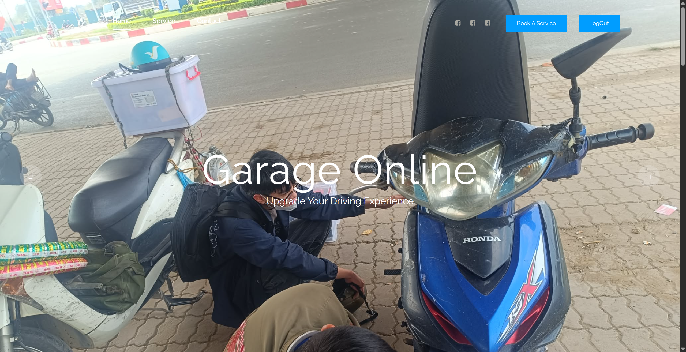
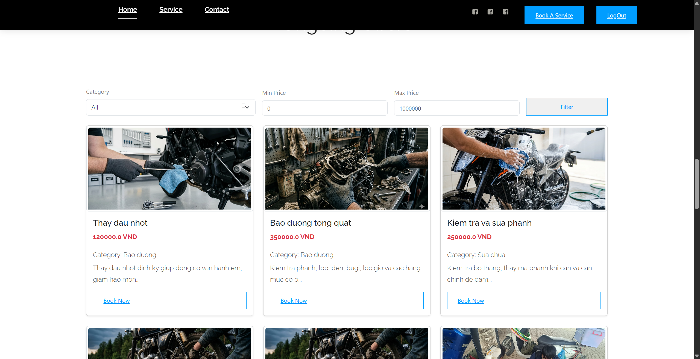
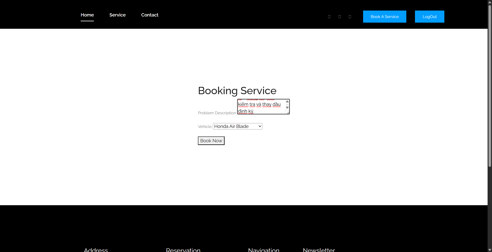
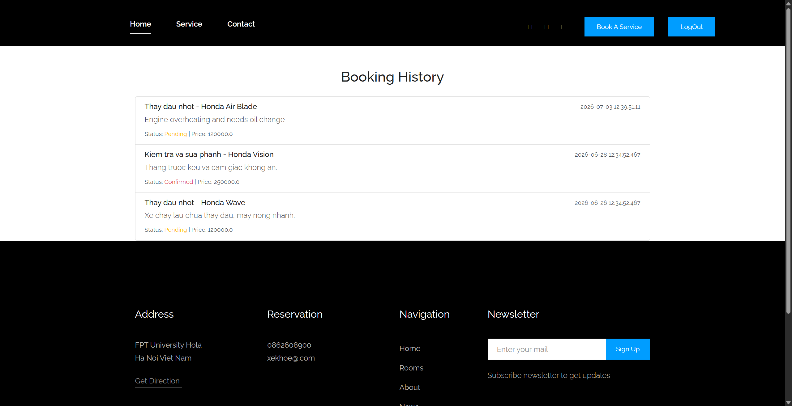
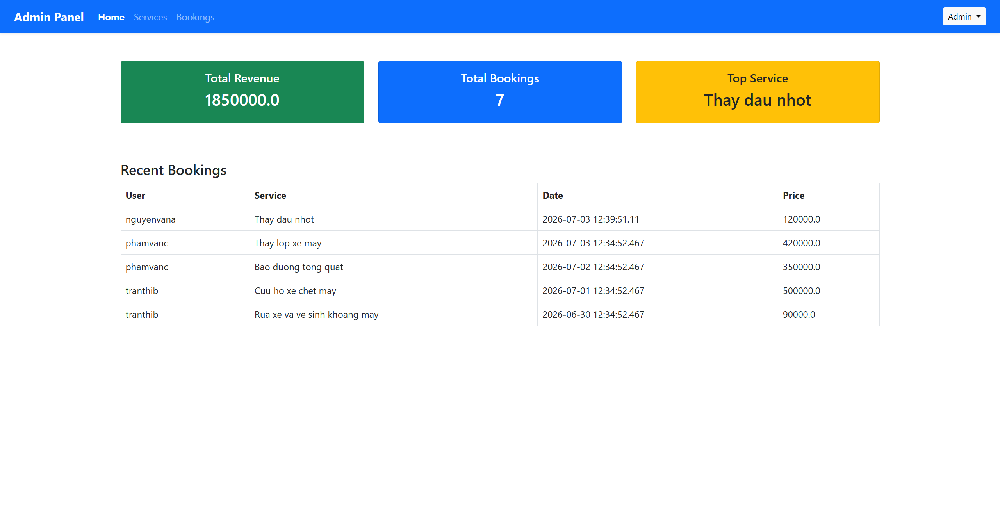
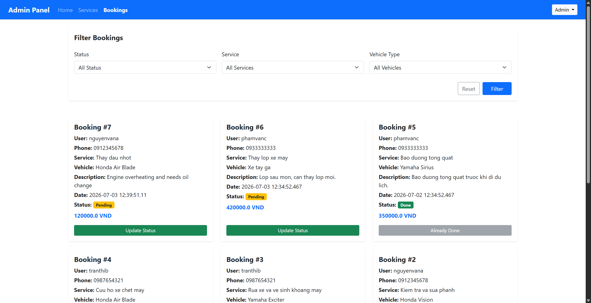

# Garage Online - Hệ Thống Đặt Lịch Sửa Xe Máy

Ứng dụng web cho phép khách hàng đặt lịch sửa xe máy trực tuyến, admin quản lý dịch vụ và đơn đặt lịch.

## Tính Năng Chính

**Khách hàng**: Xem danh sách dịch vụ, đặt lịch (chọn xe, mô tả lỗi), xem lịch sử đặt lịch, theo dõi trạng thái (Chờ → Xác nhận → Đang sửa → Hoàn thành).

**Admin**: Dashboard thống kê doanh thu/đơn hàng, quản lý dịch vụ (thêm/sửa/xóa), quản lý đơn đặt lịch (lọc, cập nhật trạng thái).

## Công Nghệ Sử Dụng

| Thành Phần | Công Nghệ |
|-----------|-----------|
| Lập trình | Java 17 |
| Web Framework | Jakarta EE 10 (Servlet, JSP) |
| Database | SQL Server 2022 |
| Build Tool | Apache Ant |
| Web Server | Apache Tomcat 10.1 |

## Cách Cài Đặt

### Bước 1: Chuẩn Bị

Cần có: Java JDK 17+, SQL Server 2022, Apache Tomcat 10.1, NetBeans hoặc Ant.

### Bước 2: Tạo Database

```bash
sqlcmd -S localhost -U sa -P 123 -i database\GarageOnline.sql
```

### Bước 3: Cấu Hình Kết Nối Database

Sửa file `web/WEB-INF/ConnectDB.properties`:
```properties
url=jdbc:sqlserver://localhost:1433;databaseName=GarageOnline;encrypt=true;trustServerCertificate=true
userID=sa
password=123
```

### Bước 4: Build Project

Dùng NetBeans (dễ nhất): File → Open Project → Chọn `garage-online` → Right-click → Clean and Build → Run.

Hoặc dùng Ant:
```bash
cd garage-online
ant clean build dist
```

### Bước 5: Deploy lên Tomcat

Copy `dist/GarageOnline.war` vào `$TOMCAT_HOME/webapps/`, khởi động Tomcat, truy cập `http://localhost:8080/GarageOnline`.

## Hình Ảnh Tính Năng Chính

### Trang Chủ



### Đăng Nhập


### Danh Sách Dịch Vụ

Lọc theo loại và mức giá, mỗi dịch vụ có nút "Book Now" để đặt lịch.



### Đặt Lịch Dịch Vụ

Điền mô tả lỗi xe, chọn xe cần sửa, xác nhận đặt lịch.



### Lịch Sử Đặt Lịch (Khách Hàng)



### Dashboard Admin

Thống kê doanh thu, số đơn đặt lịch, dịch vụ phổ biến nhất.



### Quản Lý Đơn Đặt Lịch (Admin)

Lọc theo trạng thái/dịch vụ/loại xe, cập nhật trạng thái từng đơn.



## Tài Khoản Mặc Định

| Vai trò | Username | Password |
|---------|----------|----------|
| Khách hàng | nguyenvana | 123 |
| Admin | admin | 123 |

## Trạng Thái Đơn Đặt Lịch

Pending (Chờ) → Confirmed (Xác nhận) → Repairing (Đang sửa) → Completed (Hoàn thành) → Done (Xong)

## Lỗi Thường Gặp và Cách Khắc Phục

| Lỗi | Nguyên Nhân | Cách Khắc Phục |
|-----|-----------|---------------|
| Không kết nối được database | SQL Server chưa khởi động hoặc sai tài khoản | Kiểm tra SQL Server đang chạy, sửa `ConnectDB.properties` |
| Không truy cập được `http://localhost:8080/GarageOnline` | Tomcat chưa khởi động hoặc sai port | Khởi động lại Tomcat, kiểm tra port 8080 |
